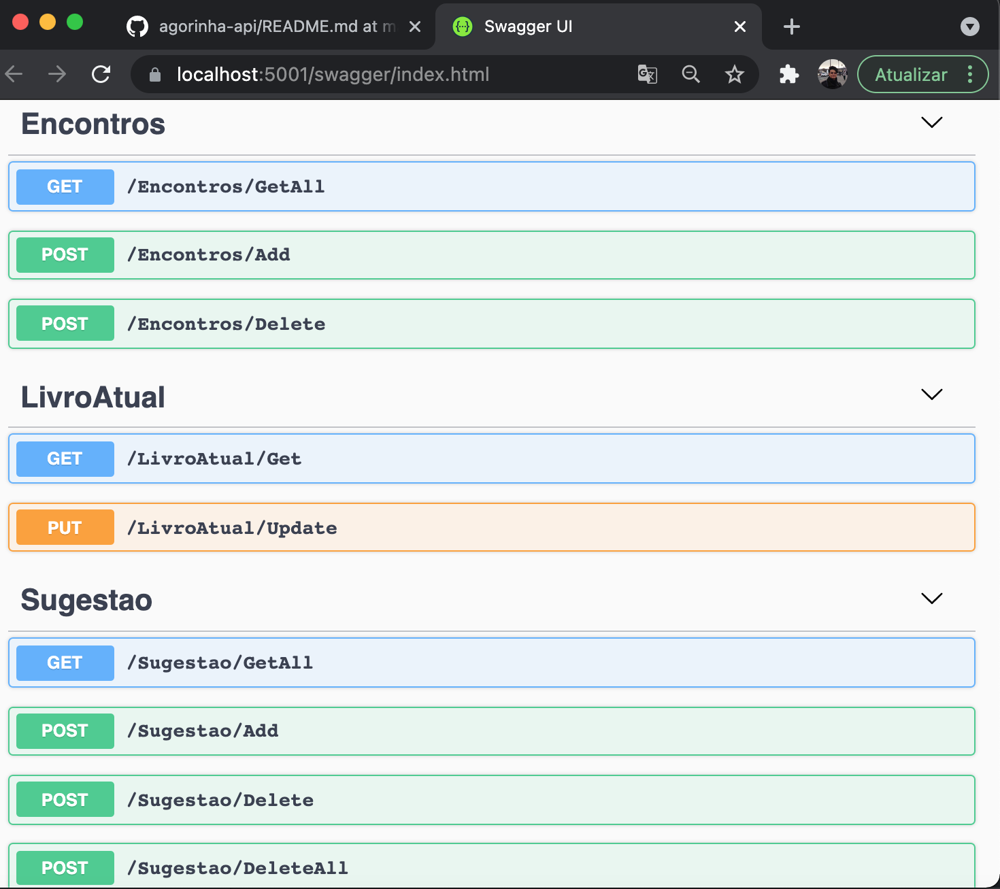

# agorinha-api
 Agorinha Middleware 
 
 
## Host Settings

`echo /agorinha-api/Properties/launchSettings.json`

## Application Url

https://localhost:5001 OR
http://localhost:5000
 
## Swagger

https://localhost:5001/swagger

## Data for POST/PUT Add/Update methods

### /Encontros/Add
Data : "dd-mm-yyyy"

### /LivroAtual/Update
Data : { \
  "name": "string", \
  "autor": "string", \
  "ano": 0, \
  "genero": "string", \
  "sinopse": "string" \
}

### /Sugestao/Add
Data : { \
  "name": "string", \
  "autor": "string", \
  "ano": 0, \
  "genero": "string", \
  "sinopse": "string" \
}

